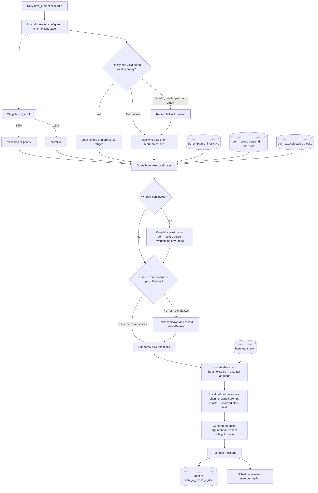

# Managed AI discussion flow

The scheduled selector chooses a complete `bom_text` block. It does not invent a verse-sized opener and it does not select directly from `lds_scriptures_lines`. `bom_lookup` is the bridge between curriculum verse ranges and selectable blocks.



## Selection and identity

- `bom_text.guid` is the durable identity of the attachment and the history key.
- `bom_lookup` supplies every canonical verse ID belonging to each block. A curriculum range is eligible when at least one of those IDs falls between its inclusive minimum and maximum.
- `lds_scriptures_lines.style`, joined at `bom_text.min_verse_id`, places a block into `discourse`, `poetry`, or `narrative` selection buckets.
- The first weighted bucket may fall back to the other bucket when it has no eligible candidates.
- `passageRef` is diagnostic metadata generated from the mapped verse IDs. It is not a separately selected or synthetic passage.

## Dated curriculum behavior

Curriculum is optional. With no active `bom_ai_passage_window`, selection remains unrestricted across the corpus. A window may contain multiple `bom_ai_passage_range` rows. Invalid, overlapping, empty, or candidate-free active configuration emits a fallback reason and safely uses unrestricted selection.

The operator file is dry-run first:

```json
{
  "channelUrl": "example-group",
  "lang": "ko",
  "windows": [
    {
      "key": "2027-w01",
      "label": "첫째 주",
      "startsOn": "2027-01-03",
      "endsOn": "2027-01-09",
      "ranges": ["1 Nephi 1-3", "1 Nephi 5"]
    }
  ]
}
```

Run `npm run passage-windows:configure -- --file curriculum.json`; add `--apply` only after review. An empty `windows` array explicitly removes that channel's configured windows. No rows are configured by the migration, so the current group stays unrestricted.

## Message linkage and metadata

The root message links straight back to the selected block:

```json
{
  "links": {
    "primary": {
      "type": "text",
      "id": "<bom_text.guid>",
      "slug": "<bom_page.slug>",
      "ordinal": 4,
      "lang": "ko"
    }
  },
  "highlights": ["선택된 블록에서 정확히 복사한 문구"],
  "contentLanguage": "ko",
  "selection": {
    "mode": "window",
    "styleBucket": "discourse_poetry",
    "style": "discourse",
    "textGuid": "<bom_text.guid>",
    "passageRef": "<localized diagnostic reference>",
    "blockVerseIds": [31103, 31104],
    "matchedVerseIds": [31103, 31104],
    "windowKey": "2027-w01",
    "windowLabel": "첫째 주",
    "matchedRange": { "ordinal": 0, "minVerseId": 31103, "maxVerseId": 31147 },
    "historyRelaxed": false,
    "fallbackReason": null
  }
}
```

GraphQL returns the attachment language with the link. The web client hydrates the `bom_text` block through `/graphql/<channel-language>`, independent of the viewer's host language, so the card and its highlight remain in the discussion's language.

## Localization ownership

| Surface | Language source | Translation mechanism |
|---|---|---|
| Channel name and description | Group configuration | Authored for that group |
| Bot name, persona, and model instructions | `bom_bot`, exact `bom_bot.lang == messenger_channels.lang` | Authored for that localized bot; no runtime prompt translation |
| Discussion task, length, moves, and guardrails | `bom_ai_discussion_config.prompt_bundle` | Authored per group; a complete bundle is required when configuring a non-English group |
| Scripture block heading and content | Canonical `bom_text.guid` | Existing `bom_translation` lookup using channel language |
| Scripture reference labels | Canonical verse IDs | Existing `scripture-guide` language layer |
| Attachment hydration | Message link `lang` | GraphQL language path chosen from channel language |
| Generic UI badges such as bot/audience | UI label catalog | Locale label, not prompt translation |

Before enabling scheduling, run `npm run scripture-styles:validate` to verify that all Book of Mormon verses and selectable block starts have one of the supported styles.
